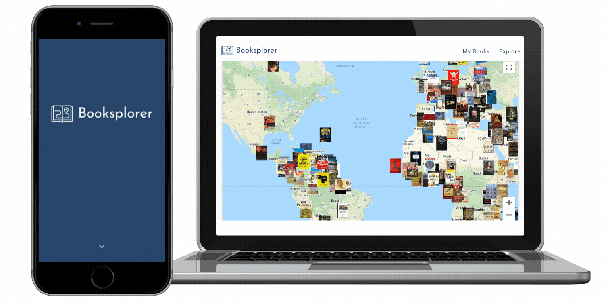

# :book: Booksplorer

  

Booksplorer is a book recommendation PWA (Progressive Web App) that allows users to to read more diversely by exploring titles across the globe.

## :books: Tech Stack
- [React](https://reactjs.org/)
- [TypeScript](https://www.typescriptlang.org/)
- [Next.js](https://nextjs.org/)
- [Material-UI](https://material-ui.com/)
- [MongoDB](https://www.mongodb.com/)
- [GraphQL](https://graphql.org/)
- [Apollo Server](https://www.apollographql.com)
- [Apollo Client](https://www.apollographql.com)

## :tada: Upcoming features 
- Add functionality to filter books by category
- Fetch/display prices from (and link to) different booksellers
- Add authentication

## :raised_hands: Contributing

Collaborations are welcome! Pick a feature (or create your own!) and fork the repo. 

Then push to your fork and submit a pull request.

## :raising_hand: Author
Camila Müller-Ludwig 

:speech_balloon: 
[github](https://github.com/camifernweh) – [LinkedIn](https://www.linkedin.com/in/cmullerludwig/)

## :page_facing_up: License 
This project is licensed under the MIT License.

